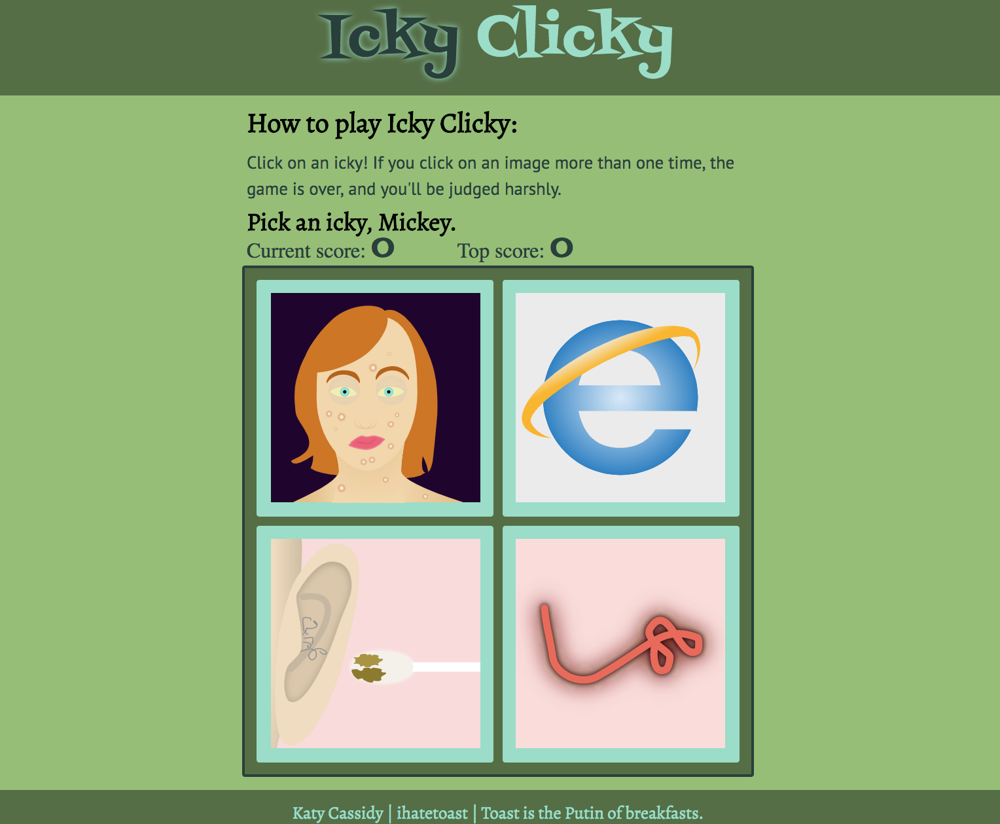

# Icky Clicky

Icky Clicky is a memory game built on ReactJS.

The player sees a grid made up of images of icky things and clicks on an image. If she has not already clicked on the image, the score increases by one point. After every click, the deck is shuffled. The user clicks on another image. As long as it's a new image, the score keeps increasing. Once the player clicks on an image she's already clicked on, the score is reset to 0, and the game begins again.

## Toolbox:

* CSS/Sass
* ReactJS
* Lodash
* Sketch App

---

### Note:

There are currently 12+ images; however, I made the grid 2x2 so that it would be harder to remember what the player's choices are and what she's already chosen. By keeping the playing grid 2x2, I can add images as I choose and not worry about having to do enough to keep a neat grid.

Version 2: Allow the player to choose a difficulty level and refresh grid if no unpicked cards are displayed.
